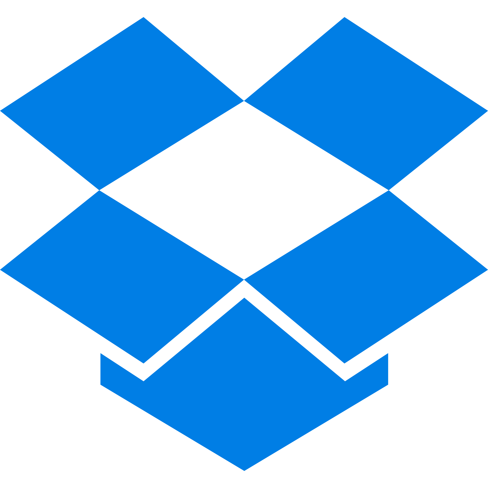
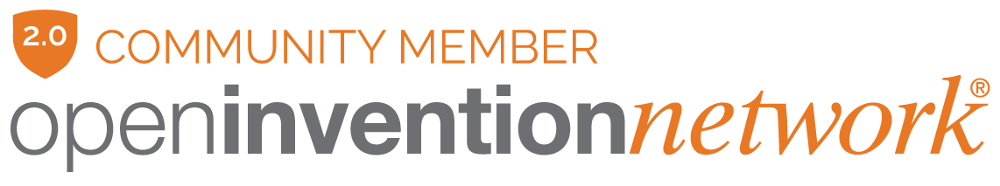

# AeroFTP

<p align="center">
  
</p>

<p align="center">
  <strong>FTP-First. Multi-Protocol. AI-Powered. Encrypted. Privacy-Enhanced.</strong>
</p>

<p align="center">
  The modern FTP client that grew into a complete file management platform. Multi-protocol, 6 integrated product modules, 47 languages, one app.
</p>

<p align="center">
  <a href="https://aeroftp.app">Website</a> · <a href="https://docs.aeroftp.app">Documentation</a> · <a href="https://github.com/axpdev-lab/aeroftp/releases">Download</a>
</p>

<!-- Row 1: Project & Quality -->
<p align="center">
  <a href="https://github.com/axpdev-lab/aeroftp/releases"></a>
  
  <a href="https://www.bestpractices.dev/projects/11994"></a>
  <a href="https://rust-reportcard.xuri.me/report/github.com/axpdev-lab/aeroftp"></a>
</p>

<!-- Row 2: App Features -->
<p align="center">
  
  
  
  
  
  
  
</p>

<!-- Row 3: Tech Stack & OS -->
<p align="center">
  
  
  
  
  
  
  
</p>

<!-- Row 3: Package Managers -->
<p align="center">
  <a href="https://snapcraft.io/aeroftp"></a>
  <a href="https://aur.archlinux.org/packages/aeroftp-bin"></a>
  <a href="https://launchpad.net/aeroftp"></a>
  <a href="https://winstall.app/apps/axpnet.AeroFTP"></a>
  <a href="https://sourceforge.net/projects/aeroftp/"></a>
</p>

<!-- Row 3: Community & Listings -->
<p align="center">
  <a href="https://openinventionnetwork.com/"></a>
  <a href="https://alternativeto.net/software/aeroftp/"></a>
  <a href="https://buymeacoffee.com/AXPNetwork"></a>
  <a href="https://github.com/sponsors/axpnet"></a>
</p>

---

## Platform Status

| Platform | Status | Packages | Notes |
|----------|--------|----------|-------|
| **Linux** | Stable | `.deb`, `.rpm`, `.snap`, `.AppImage`, AUR | Native target, fully tested |
| **Windows** | Stable | `.msi`, `.exe`, `.zip` portable, winget | Fully tested, not Microsoft Store signed |
| **macOS (Apple Silicon)** | Beta | `.dmg` (aarch64) | Not code-signed, requires `xattr` workaround |
| **macOS (Intel)** | Beta | `.dmg` (x86_64) | Not code-signed, requires `xattr` workaround |

> **macOS note:** The `.dmg` is not yet signed with an Apple Developer ID certificate. macOS Gatekeeper will block it. After installing, run: `sudo xattr -rd com.apple.quarantine /Applications/AeroFTP.app`

---

## FTP-First Design

AeroFTP is an FTP client first. Full encryption support with configurable TLS modes (Explicit AUTH TLS, Implicit TLS, opportunistic TLS), certificate verification control, MLSD/MLST machine-readable listings (RFC 3659), and resume transfers (REST/APPE). It then extends this foundation into a broad multi-protocol file management platform through six integrated product modules - the **Aero Family**.

---

## Integrations

Connect to 40+ cloud providers and services via FTP, FTPS, SFTP, WebDAV, S3, OAuth2, and native APIs.

<table align="center">
  <tr>
    <td align="center" width="72"><br><sub>AWS S3</sub></td>
    <td align="center" width="72"><br><sub>Google Drive</sub></td>
    <td align="center" width="72"><br><sub>Dropbox</sub></td>
    <td align="center" width="72"><br><sub>OneDrive</sub></td>
    <td align="center" width="72"><br><sub>MEGA</sub></td>
    <td align="center" width="72"><br><sub>Box</sub></td>
    <td align="center" width="72"><br><sub>pCloud</sub></td>
    <td align="center" width="72"><br><sub>Azure</sub></td>
    <td align="center" width="72"><br><sub>GitHub</sub></td>
    <td align="center" width="72"><br><sub>GitLab</sub></td>
  </tr>
  <tr>
    <td align="center" width="72"><br><sub>Filen</sub></td>
    <td align="center" width="72"><br><sub>Internxt</sub></td>
    <td align="center" width="72"><br><sub>kDrive</sub></td>
    <td align="center" width="72"><br><sub>Jottacloud</sub></td>
    <td align="center" width="72"><br><sub>Zoho</sub></td>
    <td align="center" width="72"><br><sub>4shared</sub></td>
    <td align="center" width="72"><br><sub>Koofr</sub></td>
    <td align="center" width="72"><br><sub>FileLu</sub></td>
    <td align="center" width="72"><br><sub>Yandex Disk</sub></td>
    <td align="center" width="72"><br><sub>Drime</sub></td>
  </tr>
  <tr>
    <td align="center" width="72"><br><sub>Nextcloud</sub></td>
    <td align="center" width="72"><br><sub>Felicloud</sub></td>
    <td align="center" width="72"><br><sub>SourceForge</sub></td>
    <td align="center" width="72"><br><sub>Hetzner</sub></td>
    <td align="center" width="72"><br><sub>Backblaze</sub></td>
    <td align="center" width="72"><br><sub>Wasabi</sub></td>
    <td align="center" width="72"><br><sub>Cloudflare R2</sub></td>
    <td align="center" width="72"><br><sub>DigitalOcean</sub></td>
    <td align="center" width="72"><br><sub>Tencent COS</sub></td>
    <td align="center" width="72"><br><sub>Oracle</sub></td>
  </tr>
  <tr>
    <td align="center" width="72"><br><sub>Storj</sub></td>
    <td align="center" width="72"><br><sub>IDrive e2</sub></td>
    <td align="center" width="72"><br><sub>Quotaless</sub></td>
    <td align="center" width="72"><br><sub>CloudMe</sub></td>
    <td align="center" width="72"><br><sub>InfiniCLOUD</sub></td>
    <td align="center" width="72"><br><sub>Jianguoyun</sub></td>
    <td align="center" width="72"><br><sub>Seafile</sub></td>
    <td align="center" width="72"><br><sub>DriveHQ</sub></td>
    <td align="center" width="72"><br><sub>Yandex Cloud</sub></td>
    <td align="center" width="72"><br><sub>DriveHQ X</sub></td>
  </tr>
</table>

<p align="center"><sub>+ FTP, FTPS, SFTP, WebDAV, Swift protocols</sub></p>

> See the [protocol features matrix](docs/PROTOCOL-FEATURES.md) for full per-provider capabilities.

---

## The Aero Family

```
AeroFTP
├── AeroCloud    - Personal cloud (27 protocols, sync, share)
├── AeroFile     - Professional file manager
├── AeroSync     - Bidirectional sync engine
├── AeroVault    - Military-grade encryption
├── AeroTools    - Code editor + Terminal + AI chat
│   └── AeroAgent    - AI-powered assistant (47 tools, 19 providers)
├── AeroFTP CLI  - Production command-line client (vault profiles, JSON output, batch scripting, agent discovery)
└── AeroPlayer   - Media player with visualizers
```

---

### AeroCloud - Your Personal Cloud

> [Full documentation →](https://docs.aeroftp.app/features/aerocloud.html)

Turn **any server** into a private personal cloud. Connect to 27 protocols with bidirectional sync, selective sync, file versioning, .aeroignore, share links, and per-project folders. Background tray sync with native OS file manager badges (Nautilus, Nemo, Windows Explorer). See the [protocol features matrix](docs/PROTOCOL-FEATURES.md) for full per-provider capabilities.

---

### AeroFile - Professional File Manager

> [Full documentation →](https://docs.aeroftp.app/features/aerofile.html)

A full-featured local file manager built into AeroFTP. Toggle between remote and local modes, or use both side-by-side. Three view modes (list, grid, large icons), Places sidebar with drives and network shares, Quick Look preview (Space), drag-and-drop transfers, batch rename, duplicate finder, disk usage treemap, trash browser, properties dialog with checksums, and 20+ keyboard shortcuts.

---

### AeroSync - Bidirectional Sync Engine

> [Full documentation →](https://docs.aeroftp.app/features/aerosync.html)

Enterprise-grade file synchronization built for real-world reliability. Three sync profiles (Mirror, Two-way, Backup), conflict resolution center with per-file strategies, SHA-256 checksum verification, transfer journal with checkpoint/resume, configurable retry with exponential backoff, bandwidth control, post-transfer verification (4 policies), and structured error taxonomy with 10 categories. Integrates with AeroCloud for background tray sync.

---

### AeroVault - Military-Grade Encryption

> [Full documentation →](https://docs.aeroftp.app/features/aerovault.html)

[](https://crates.io/crates/aerovault)
[](https://docs.rs/aerovault)

Create, manage, and browse encrypted containers that protect your files with a security stack that exceeds industry standards. The encryption engine is published as the standalone [`aerovault`](https://crates.io/crates/aerovault) crate on crates.io for use in any Rust project.

**AeroVault v2 (.aerovault containers)**

| Component | Algorithm | Details |
| --------- | --------- | ------- |
| **Content encryption** | AES-256-GCM-SIV (RFC 8452) | Nonce misuse-resistant - even nonce reuse doesn't compromise security |
| **Key wrapping** | AES-256-KW (RFC 3394) | Built-in integrity check on unwrap |
| **Filename encryption** | AES-256-SIV | Deterministic - file names are hidden, not just content |
| **Key derivation** | Argon2id | 128 MiB memory / 4 iterations / 4 parallelism (exceeds OWASP 2024) |
| **Header integrity** | HMAC-SHA512 | 512-bit MAC, quantum-resistance margin |
| **Cascade mode** | ChaCha20-Poly1305 | Optional double encryption layer for defense-in-depth |
| **Chunk size** | 64 KB | Per-chunk random nonce + authentication tag |

> **Open format**: The `.aerovault` binary format is fully documented in the [AeroVault v2 Specification](docs/AEROVAULT-V2-SPEC.md) with implementation guides for Rust, Java, Python, Go, C, and JavaScript.

**Additional encryption features**:
- **Directory support**: Create nested folders inside vaults with encrypted directory entries, hierarchical navigation, and recursive delete
- **Cryptomator**: Create and browse Cryptomator format 8 vaults (scrypt + AES-SIV + AES-GCM) via context menu
- **Archive Browser**: Browse ZIP, 7z, TAR, RAR contents in-app without extracting. Selective single-file extraction
- **Archive Encryption**: ZIP and 7z with AES-256 password protection. Compression levels (Store/Fast/Normal/Maximum)

---

### AeroTools - Code Editor, Terminal & AI Chat

> [Full documentation →](https://docs.aeroftp.app/features/aerotools.html)

Integrated development panel with three tools in a tabbed interface: **Monaco Editor** (VS Code engine, 50+ languages, remote file editing), **SSH Terminal** (8 themes, multiple tabs), and **AeroAgent AI Chat** with bidirectional editor sync.

#### AeroAgent - AI-Powered Assistant

An AI assistant with **47 tools** that work across local files and remote providers. Supports **19 AI providers** (OpenAI, Anthropic, Gemini, xAI, Ollama, DeepSeek, Mistral, and 12 more). Vision/multimodal, RAG indexing, plugin ecosystem, streaming responses, multi-step autonomous execution, native MCP server mode, and Command Palette (Ctrl+Shift+P).

---

### Agent-Ready by Design

> [Full documentation →](https://docs.aeroftp.app/features/agent-ready.html)

AeroFTP is built for both humans and AI agents. As agentic AI, computer use, and autonomous coding assistants become the standard way to interact with computers, AeroFTP provides native interfaces for both use cases.

**For AI Agents (CLI)**: Tools like Claude Code, Open Interpreter, Cline, Aider, Devin, Codex, Cursor Agent, Windsurf, and other agentic frameworks can call `aeroftp-cli` directly. Structured `--json` output, vault-based `--profile` credentials (agents never see passwords), semantic exit codes, and `.aeroftp` batch scripts make AeroFTP a first-class tool in any agent's toolkit. External agents can also invoke `aeroftp-cli agent` to orchestrate AeroAgent as a credential-isolating proxy for multi-server operations. See [Agent Orchestration](https://docs.aeroftp.app/features/agent-orchestration) for the full orchestration guide, CLI reference, and a verified field test report.

**For Humans (GUI + AeroAgent)**: The desktop app provides drag-and-drop file management with AeroAgent, the integrated AI assistant offering 48 tools across local files and remote providers. AeroAgent supports multi-step autonomous execution, tool approval workflows with backend-enforced grants, and 19 AI providers.

---

### AeroFTP CLI - Command-Line Client

> [Full documentation →](https://docs.aeroftp.app/cli/installation.html)

Production CLI sharing the same Rust backend as the GUI. 32 subcommands, 27 protocols, encrypted vault profiles, JSON output, batch scripting, and native MCP server mode for AI integration.

```bash
aeroftp-cli ls --profile "My Server" /var/www/ -l        # Vault profile (no credentials exposed)
aeroftp-cli get sftp://user@host "/data/*.csv"            # Glob download
aeroftp-cli serve http sftp://user@host /data             # Serve remote as local HTTP
aeroftp-cli serve webdav s3://key:secret@s3.aws.com       # Serve remote as local WebDAV
aeroftp-cli agent --mcp                                   # MCP server for Claude/Cursor/VS Code
```

**Key features**: `--profile` credential isolation for AI agents, `--json` structured output, semantic exit codes (0-8), `.aeroftp` batch scripts, `serve http/webdav`, MCP server mode, `NO_COLOR` compliant. See the **[CLI Guide](https://docs.aeroftp.app/cli/installation.html)** and **[Credential Isolation](https://docs.aeroftp.app/credential-isolation)** docs.

---

### AeroPlayer - Media Engine

> [Full documentation →](https://docs.aeroftp.app/features/aeroplayer.html)

Built-in media player with 14 GPU-accelerated visualizer modes (Canvas 2D + WebGL 2 shaders), 10-band graphic EQ with presets, beat detection, and post-processing effects. Zero dependencies - native HTML5 Audio + Web Audio API.

---

## Privacy-Enhanced

AeroFTP incorporates privacy protections that go beyond what traditional file managers offer.

| Feature | Details |
| ------- | ------- |
| **Master Password** | Optional Argon2id vault encryption - all credentials locked behind a single password |
| **Encrypted Vault** | All sensitive data in AES-256-GCM encrypted storage - zero plaintext on disk |
| **Zero Telemetry** | No analytics, no phone-home, no network requests beyond user-initiated connections |
| **Memory Zeroization** | Passwords and keys cleared from RAM immediately after use |
| **Clearable History** | One-click clear for recent locations. No persistent browsing traces |
| **Portable Deployment** | AppImage runs without installation. Remove it and the config directory - no traces remain |

See [SECURITY.md](SECURITY.md) for the security policy and architecture summary, and [docs.aeroftp.app/security](https://docs.aeroftp.app/security/overview) for the complete security documentation with encryption specs, AI security model, supply chain details, and audit history.

### Security Posture

| | |
|---|---|
| **OpenSSF Best Practices** | [100% passing](https://www.bestpractices.dev/projects/11994) - all 67 criteria met |
| **Aikido Security** | Continuous SAST/SCA monitoring - **Top 5% benchmark**, OWASP Top 10 coverage, 0 open issues |
| **Socket.dev** | Supply chain SCA monitoring on every push - dependency risk scoring, typosquatting detection |
| **Dependency Scanning** | 1,156 packages monitored (320 JS + 836 Rust), daily automated scans |
| **Supply Chain** | All GitHub Actions pinned to SHA hashes, Dependabot enabled, [Sigstore](https://sigstore.dev) signing with client-side verification |
| **Security Audits** | 300+ findings resolved across [9 independent audits](https://docs.aeroftp.app/security/audits) - grade A- |
| **Security Audit** | [March 2026](docs/Security%20Audit%20Report%20axpdev-lab%20-%20March%202026.pdf) - [February 2026](docs/Security%20Audit%20Report%20axpnet%20-%20February%202026.pdf) (Aikido Security) |

---

## Additional Features

### 4 Themes
Light, Dark, Tokyo Night, and Cyber - with themed icons, terminal colors, Monaco editor syntax, and CSS custom properties throughout.

### Security Toolkit (Cyber theme)
Hash Forge (MD5, SHA-1, SHA-256, SHA-512, BLAKE3), CryptoLab (AES-256-GCM, ChaCha20-Poly1305 encrypt/decrypt), Password Forge (CSPRNG + BIP39 passphrase generator with entropy display).

### 47 Languages at 100% Coverage

Quality-audited translations with native script integrity. Automatic browser language detection.

| | | | | |
|---|---|---|---|---|
| :gb: English | :it: Italian | :de: German | :es: Spanish | :fr: French |
| :portugal: Portuguese | :ru: Russian | :jp: Japanese | :kr: Korean | :cn: Chinese |
| :india: Hindi | :bangladesh: Bengali | :tr: Turkey | :poland: Polish | :netherlands: Dutch |
| :sweden: Swedish | :denmark: Danish | :norway: Norwegian | :finland: Finnish | :iceland: Icelandic |
| :czech_republic: Czech | :hungary: Hungarian | :romania: Romanian | :ukraine: Ukrainian | :greece: Greek |
| :thailand: Thai | :vietnam: Vietnamese | :indonesia: Indonesian | :malaysia: Malay | :philippines: Filipino |
| :cambodia: Khmer | :georgia: Georgian | :armenia: Armenian | :bulgaria: Bulgarian | :croatia: Croatian |
| :serbia: Serbian | :slovakia: Slovak | :slovenia: Slovenian | :macedonia: Macedonian | :estonia: Estonian |
| :lithuania: Lithuanian | :latvia: Latvian | :wales: Welsh | Catalan | Galician |
| Basque | :kenya: Swahili | | | |

### Auto-Updater
- In-app download with progress bar showing speed and ETA
- "Install & Restart" for .deb, .rpm, and AppImage - detached relaunch survives parent exit
- Non-intrusive update toast with auto-dismiss (StatusBar badge for persistent access)
- Periodic background check every 24 hours

---

## Installation

### Linux

#### Snap Store
```bash
sudo snap install aeroftp
```

<p align="center">
  <a href="https://snapcraft.io/aeroftp">
    
  </a>
</p>

> **Note:** Snap has limited filesystem access due to strict confinement. For full access, use .deb, .AppImage, or AUR.

#### AUR (Arch Linux)
```bash
yay - S aeroftp-bin
# or
paru - S aeroftp-bin
```

<p align="center">
  <a href="https://aur.archlinux.org/packages/aeroftp-bin">
    
  </a>
</p>

> Available on Arch Linux and derivatives (Manjaro, EndeavourOS, Garuda). Binary package - no compilation needed.

#### Launchpad PPA (Ubuntu / Debian)

Visit [launchpad.net/aeroftp](https://launchpad.net/aeroftp) for PPA instructions and .deb packages.

#### Other Linux Formats
Download from [GitHub Releases](https://github.com/axpdev-lab/aeroftp/releases/latest):
- **.deb** - Ubuntu, Debian, Linux Mint, Pop!_OS
- **.rpm** - Fedora, openSUSE, RHEL
- **.AppImage** - Portable, runs on any distro ([AppImageHub](https://appimage.github.io/AeroFTP/))

### Windows

#### Winget
```powershell
winget install axpnet.AeroFTP
```

<p align="center">
  <a href="https://winstall.app/apps/axpnet.AeroFTP">
    
  </a>
</p>

> Available on Windows 10 (1709+) and Windows 11. Requires [App Installer](https://apps.microsoft.com/detail/9NBLGGH4NNS1) from Microsoft Store.

#### Other Windows Formats
Download from [GitHub Releases](https://github.com/axpdev-lab/aeroftp/releases/latest):
- **.exe** - NSIS installer
- **.msi** - Windows Installer

> **Note:** Windows builds are not currently published on the Microsoft Store. The installer is not code-signed (no EV certificate), so Windows SmartScreen may show a warning on first run - this is safe to dismiss.

### macOS

Download from [GitHub Releases](https://github.com/axpdev-lab/aeroftp/releases/latest):
- **.dmg** - Universal disk image

> **Note:** The macOS build is not notarized (no Apple Developer certificate). macOS Gatekeeper will block the app on first launch - right-click the app and select "Open" to bypass. See [#47](https://github.com/axpdev-lab/aeroftp/issues/47) for known issues on Apple Silicon.

### Verifying Release Integrity

All release artifacts are signed with [Sigstore](https://sigstore.dev) using keyless signing via GitHub OIDC. Each release includes `.sigstore.json` verification bundles.

Install [cosign](https://docs.sigstore.dev/cosign/system_config/installation/), then verify any downloaded artifact:

```bash
cosign verify-blob \
  --bundle AeroFTP_3.1.3_amd64.deb.sigstore.json \
  --certificate-identity "https://github.com/axpdev-lab/aeroftp/.github/workflows/build.yml@refs/tags/v3.1.3" \
  --certificate-oidc-issuer "https://token.actions.githubusercontent.com" \
  AeroFTP_3.1.3_amd64.deb
```

This proves the artifact was built by our CI pipeline from the tagged commit. Replace filenames and version with your download.

---

## Support the Project

AeroFTP is free and open source software. If you find it useful, please consider supporting its development:

### Donate

- **GitHub Sponsors**: [github.com/sponsors/axpnet](https://github.com/sponsors/axpnet)
- **Buy Me a Coffee**: [buymeacoffee.com/axpnet](https://buymeacoffee.com/axpnet)

### Cryptocurrency

- **Bitcoin (BTC)**: `bc1qdxur90s5j4s55rwe9rc9n95fau4rg3tfatfhkn`
- **Ethereum (ETH/EVM)**: `0x08F9D9C41E833539Fd733e19119A89f0664c3AeE`
- **Solana (SOL)**: `25A8sBNqzbR9rvrd3qyYwBkwirEh1pUiegUG6CrswHrd`
- **Litecoin (LTC)**: `LTk8iRvUqAtYyer8SPAkEAakpPXxfFY1D1`

### Contributing

Contributions are welcome. Please open an issue to discuss proposed changes before submitting a pull request.

---

## License

GPL-3.0 - See [LICENSE](LICENSE) for details.

---

<p align="center">
  <a href="https://www.bestpractices.dev/projects/11994"></a>
</p>

<table align="center">
  <tr>
    <td align="center">
      <a href="https://openinventionnetwork.com/"></a>
    </td>
    <td align="center">
      <a href="https://opensource.org"></a>
    </td>
    <td align="center">
      <a href="https://sigstore.dev"></a>
    </td>
  </tr>
  <tr>
    <td align="center"><sub>OIN 2.0 Community Member</sub></td>
    <td align="center"><sub>OSI Individual Member</sub></td>
    <td align="center"><sub>Sigstore Signed Releases</sub></td>
  </tr>
</table>

<p align="center">
  <em>Built with Rust (Tauri 2) + React 18 + TypeScript</em>
</p>

---

<!-- Platform Status Badges -->
<p align="center">
  
  
  
  
  
</p>

<p align="center">
  <sub>
    Designed, architected and maintained by <a href="https://github.com/axpnet">axpnet</a>.<br>
    AI tools (Claude Code, Codex, Gemini) were used extensively for translations, code review,<br>
    implementation and documentation, always under strict human-defined specifications and patterns.<br>
    Every feature, design decision and architectural choice is human-driven.<br>
    AI accelerated development; it did not direct it.<br>
    <a href="AI-TRANSPARENCY.md">Full AI Transparency Statement</a>
  </sub>
</p>
